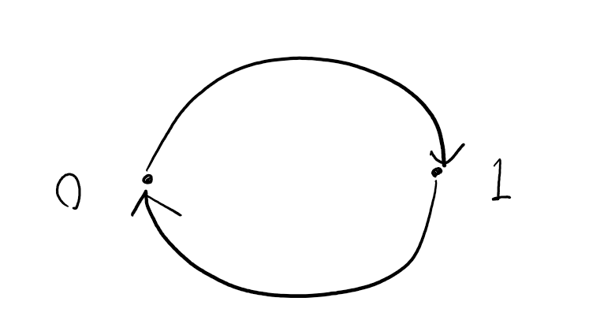
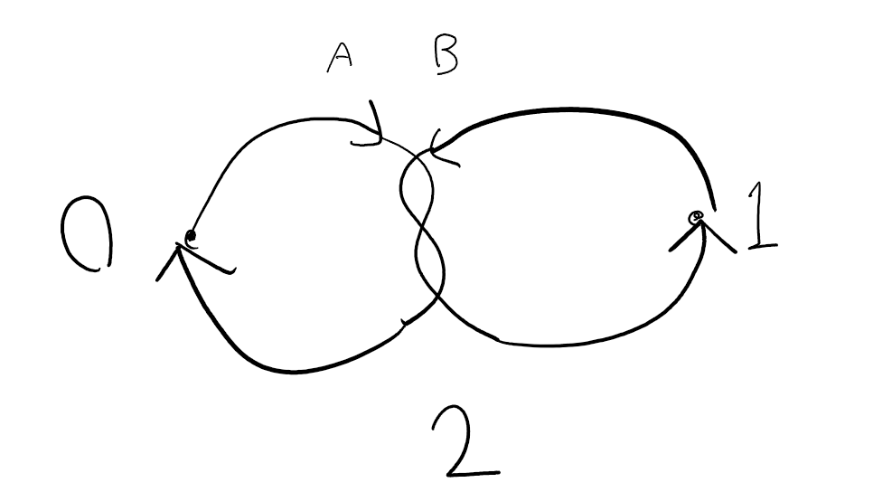
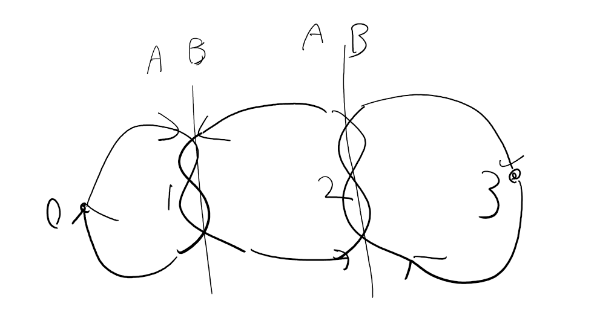
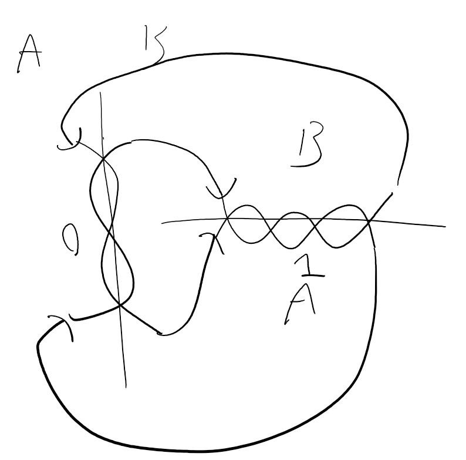
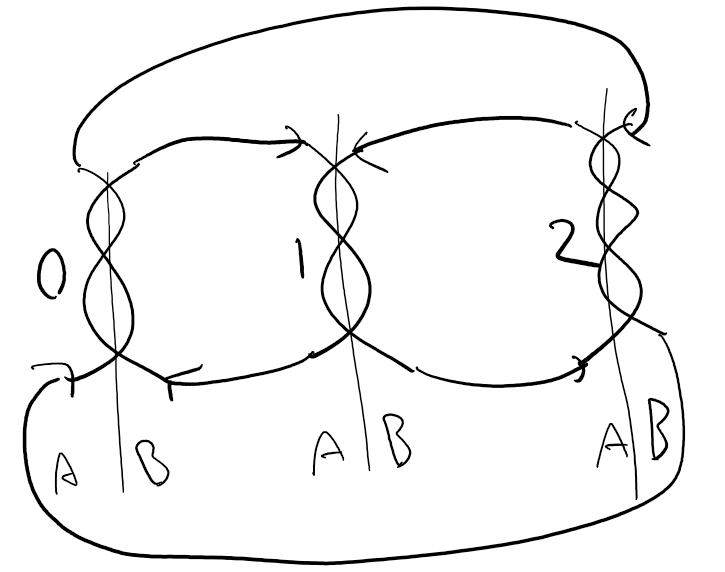

# 結び目のグラフとしての表現(step3まででチェック)

## 目次
1. 概要
2. グラフとしての特徴
3. 結び目→グラフ
4. グラフ→結び目
5. 資料

## 1. 概要
一本のひもにRI+/S+をすることで構成された結び目を多重有向グラフ(多重辺や自己ループを持つ有向グラフ)として表現する。


結び目を頂点としてみると、結び目aから結び目bへ伸びる部分は辺(a, b)とみなすことができる。

## 2. グラフとしての特徴と制約
### グラフとしての特徴
結び目を有向グラフで表現したもの(以下、結び目グラフと表記する。)の特徴をまとめる。

#### オイラーグラフである
結び目の特性として、ある点を始点としてひもをたどった時に、かならず結び目の全ての部分を一回ずつ通って始点に戻る。これをグラフの性質として言い換えると、**全ての辺を一回ずつ使って最初の点に戻る経路** が存在するといえ、この経路のことを **オイラー閉路** といい、オイラー閉路が存在するグラフを **オイラーグラフ** という。つまり、結び目グラフはオイラーグラフである。

#### 各頂点の次数は偶数
オイラーグラフの特徴として、全ての頂点の入次数と出次数が等しいということがある。結び目グラフはオイラーグラフであるため、この特徴を持つ。また、入次数=出次数の性質から次数が偶数であることも保証される。

### 制約
書きます。

## 3. 結び目→グラフ
結び目をグラフに変換する手法について書く。

この時、結び目Kiに対してグラフGiがただ一つ定まるように定義する。

### データ構造
各頂点の軸に対して、片側をA、もう片側をBとする。
#### 頂点
偶奇を持つ。
|種類|説明|性質|
|:-|:-|:-|
|None|空頂点|入次数=出自数=1の場合消去できる。|
|Odd|奇数個の交点を持つ頂点|A(B)に入ったらB(A)から出る。|
|Even|偶数個の頂点を持つ交点|A(B)に入ったらA(B)から出る。|

#### 辺
`(u, v, Tu, Tv)`の形式であらわす。
|値|説明|値|
|:-|:-|:-|
|u|辺の始点|int|
|v|辺の終点|int|
|Tu|辺がuのどこから生えているか|`A`, `B`, `None`|
|Tv|辺がvのどこに繋がるか|`A`, `B`, `None`|

### 判定
空頂点を無視し、頂点の制約を満たすオイラー閉路を求める。グラフ変換をする前の一筆書きと一致していればよい。

## 4. グラフ→結び目
グラフを結び目に復元する手法について書く。

この時、結び目Kiを変換したグラフOiが存在するとして、Oiを復元するとKiと同一の結び目Kjになるように定義する。


### アルゴリズム
1. 適当に辺(u, v)を一つ選ぶ
2. 自分の位置をvに更新する
3. vの偶奇とどこへ入ったかから、次の辺がABどちらから出るか判定する
4. その辺を消す
5. vから出ている辺のうち、3の条件を満たす辺(u, v)を選ぶ
6. 2に戻る

step3-3(P1-2ab)でバグるので直してね

### 実装
[algorithms.py](../graphs/algorithms.py)

### 実行結果
#### g_0
```
Nodes: [(0, {'parity': None}), (1, {'parity': None})]
EulerC: [(0, 1, {'Tu': None, 'Tv': None}), (1, 0, {'Tu': None, 'Tv': None})]
```


#### g_1
```
Nodes: [(0, {'parity': None}), (1, {'parity': None}), (2, {'parity': 'Odd'})]
EulerC: [(0, 2, {'Tu': None, 'Tv': 'A'}), (2, 1, {'Tu': 'B', 'Tv': None}), (1, 2, {'Tu': None, 'Tv': 'B'}), (2, 0, {'Tu': 'A', 'Tv': None})]
```


#### g_2_1
```
Nodes: [(0, {'parity': None}), (1, {'parity': 'Odd'}), (2, {'parity': 'Odd'}), (3, {'parity': None})]
EulerC: [(0, 1, {'Tu': None, 'Tv': 'A'}), (1, 2, {'Tu': 'B', 'Tv': 'A'}), (2, 3, {'Tu': 'B', 'Tv': None}), (3, 2, {'Tu': None, 'Tv': 'B'}), (2, 1, {'Tu': 'A', 'Tv': 'B'}), (1, 0, {'Tu': 'A', 'Tv': None})]
```


#### g_2_2
```
Nodes: [(0, {'parity': 'Odd'}), (1, {'parity': 'Even'})]
EulerC: [(0, 1, {'Tu': 'B', 'Tv': 'B'}), (1, 0, {'Tu': 'B', 'Tv': 'A'}), (0, 1, {'Tu': 'B', 'Tv': 'A'}), (1, 0, {'Tu': 'A', 'Tv': 'A'})]
```


#### g_2_3
```
Nodes: [(0, {'parity': 'Odd'}), (1, {'parity': 'Odd'}), (2, {'parity': 'Even'})]
EulerC: [(0, 1, {'Tu': 'B', 'Tv': 'A'}), (1, 2, {'Tu': 'B', 'Tv': 'A'}), (2, 1, {'Tu': 'A', 'Tv': 'B'}), (1, 0, {'Tu': 'A', 'Tv': 'B'}), (0, 2, {'Tu': 'A', 'Tv': 'B'}), (2, 0, {'Tu': 'B', 'Tv': 'A'})]
```


## 6. 資料
+ [結び目理論 - Wikipedia](https://ja.m.wikipedia.org/wiki/%E7%B5%90%E3%81%B3%E7%9B%AE%E7%90%86%E8%AB%96)
+ [競プロにおけるオイラー路とその応用について](https://kokiymgch.hatenablog.com/entry/2017/12/07/193238)
+ [グラフ理論とNetworkX](https://docs.pyq.jp/python/math_opt/graph.html)