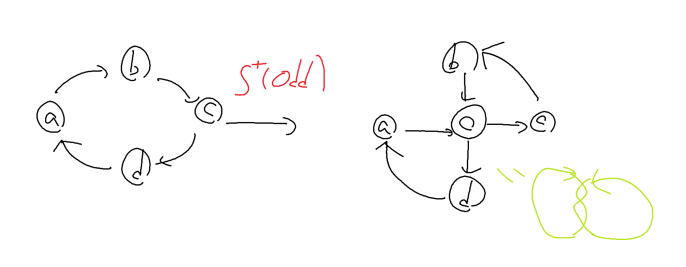

## S+について

S+には二種類ある。
1. Odd追加
2. Even追加

である。

### 前提
1. ある頂点を始点かつ終点として、全ての辺を一回ずつ通るような経路が存在する。(ひもの性質より)
2. ある頂点を始点かつ終点として、辺の重複なく、かつ始点を2回しか通らない経路が存在する。
3. OddまたはEvenブロックが一個以上ある場合、そのブロックを始点かつ終点とした、互いに辺の重複が無い経路が二つ得られる。(有向グラフとみた場合)


### Odd追加
前提2の経路を考える。その内二つの辺を選ぶと、必ず向きが反対になる。そのためここにOddを追加できる。

この経路を(a, b)...(c, d)...(?, a)と表すとき、(a, b), (c, d)を消去し(a, O)(b, O) (O, c)(O, d)の辺を追加することで前提を保ったままOddの追加ができる。(?, a) == (c, d)でもよい。


#### この時、(a, b)と(c, d)の間にある辺は逆転する。

例: [(a, b), (b, c), (c, d), (d, a)]という経路が存在する。(a, b)と(c, d)に対してS+(Odd)を行うと、(a, b)は(a, O), (b, O)になり、(c, d)は(O, c), (O, d)になり、間の(b, c)は(c, b)になる。

全体としての辺は(a, O), (b, O), (O, c), (O, d), (c, b), (d, a)になる。


### Even追加
ある点を始点としたけいろを二つ考える。それぞれ[(a, b)...(?, a)], [(a, c)...(?, a)]とする。
この時(a, b)と(a, c)を消して(a, E), (E, b), (a, E), (E, c)を追加できる。

##### 仮説
選んだ頂点のtypeでどうつくか変わりそう
A→(P, a), (P, b)を(P, E), (E, a), (P, E), (E, b)にする
B→全ての辺を一回ずつ通るようなP始点の経路の最初と最後を(P, a), (b, P)とすると(P, E), (E, a), (b, E), (E, P)にする

---

## 空頂点の削除について。
ある空頂点iが存在し、辺(a, i)と(i, b)が存在する場合、その2辺を削除し(a, b)の辺を追加することができる。

---

## 頂点の分割について
頂点は
+ Odd→Odd+Even
+ Even→Odd+Odd | Even+Even

に分割出来る。

```まずはOddのタイプを判別する必要がある。typeAとtypeBである。そのOを始点にした経路を二つ用意し、それらが異なるならtypeA, 同じならtypeBである。

Evenのタイプ判別はOddの逆である。(E始点の二つの経路が同じならtypeA, 異なるならtypeB)
```

↑違う。

### OddがtypeAの場合の分割
1. (O, a), (O, b)を削除し、(O, E), (E, a) (O, E), (E, b)を追加する。
2. (c, O), (d, O)を削除し、(c, E), (d, E), (E, O), (E, O)を追加する。
 
### OddがtypeBの場合の分割
Oを始点とした、全ての辺を一回ずつ通る経路[(O, a)...(b, O)]を見つける。(O, a), (b, O)を削除し(O, E), (E, a), (b, E), (E, O)を追加する。


### EvenがtypeAの場合の分割
(a, E), (b, E), (E, c), (E, d)を削除し、(a, O1), (b, O1), (O1, O2), (O1, O2), (O2, c), (O2, d)を追加する。

### EvenがtypeBの場合の分割
Eを始点とした経路が2つある。それぞれを
+ A: [(E, a)...(b, E)]
+ B: [(E, c)...(d, E)]

とする。この時

(E, a), (b, E), (E, c), (d, E)を削除し、(O1, a), (b, O2), (O2, c), (d, O1), (O1, O2)と(O2, O1)を追加する。


EvenをE+Eに分割するときはO1, O2をE1, E2に読み替えて操作すればよい。